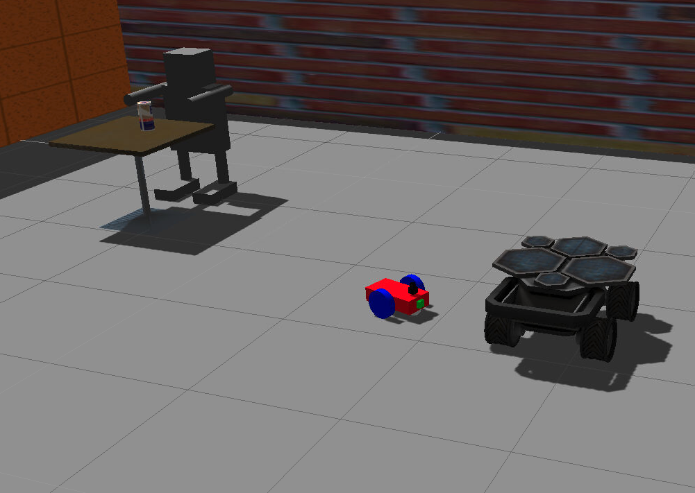
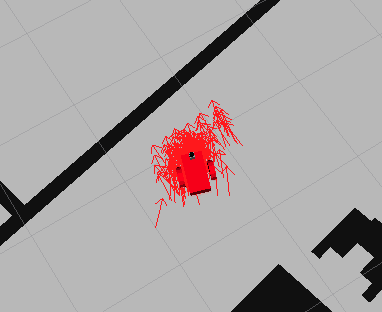

# Where am I?

## World


## Localization results

*Tunned Parameters*
```
<!-- Filter Parameters -->
    <param name="min_particles" value="100"/>
    <param name="max_particles" value="300"/>
    <param name="update_min_a" value="0.1"/>
    <param name="update_min_d" value="0.25"/>

    <!-- Laser Parameters -->
    <param name="laser_max_beams" value="60"/>
    <param name="laser_z_rand" value="0.5"/>
    <param name="laser_z_hit" value="0.95"/>

    <!-- Odometry -->    
    <param name="odom_frame_id" value="odom"/>
    <param name="odom_model_type" value="diff-corrected"/>
    <param name="base_frame_id" value="robot_footprint"/>
    <param name="global_frame_id" value="map"/>

    <!-- If you choose to define initial pose here -->
    <param name="initial_pose_x" value="0"/>
    <param name="initial_pose_y" value="0"/>
  </node>
```

